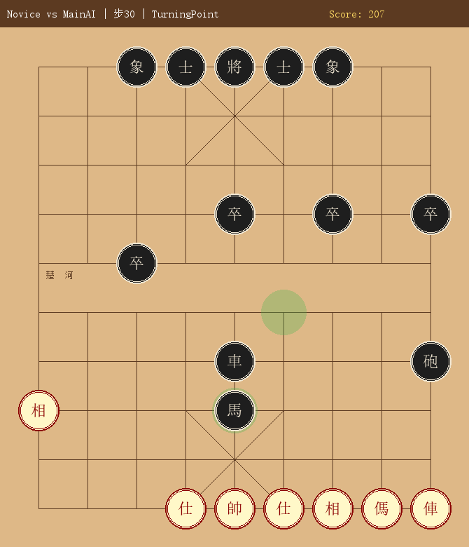
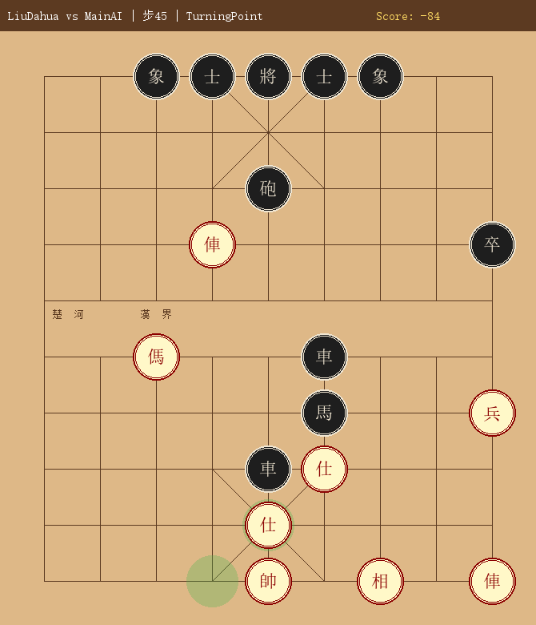
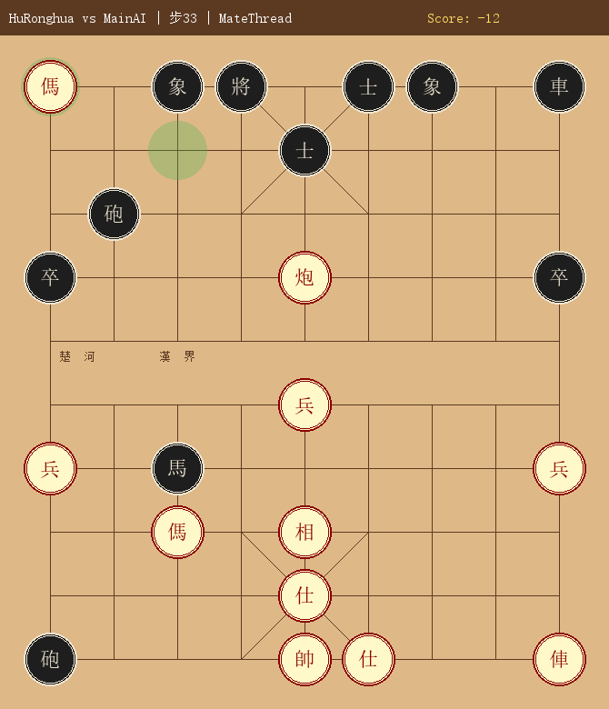

# Chinese Chess AI / 中國象棋 AI

A web-based Chinese Chess (象棋/Xiangqi) game with an intelligent AI engine featuring advanced evaluation theory, three opponent personalities, and self-play training data.

## Features

### Core Engine
- **Complete rule implementation**: all 7 piece types with correct movement, flying general rule, hobbled horse, cannon screen-capture, and palace restrictions
- **Alpha-beta search** with quiescence search and move ordering (MVV-LVA)
- **Iterative deepening** ready; configurable search depth per personality

### 擒王分數 (Catch-the-King Score)
The primary scoring principle: every evaluation is ultimately about how many moves until one side's king is caught. Forced mates score `30000 - depth_to_mate`, so faster checkmates always rank above slower ones. The opponent's best defensive replies are fully accounted for through the alpha-beta framework.

### 子根理論 (Root Theory)
Piece-protection analysis that classifies every capturable piece:

| Type | 分類 | Description | Score Adjust |
|------|------|-------------|-------------|
| **無根** | Rootless | Capturing it is profitable — undefended or under-defended | +15 |
| **虛根** | False Root | Appears defended but recapture loses material | +5 |
| **有根** | Rooted | Well-defended; capturing it loses material | −5 |

Static Exchange Evaluation (SEE) computes the full capture exchange sequence to determine root type.

### Three AI Personalities

| Name | Difficulty | Style | Search Depth |
|------|-----------|-------|-------------|
| **初學者** (Beginner) | Easy | Shallow, random from top-3 | 1 |
| **柳大華** (Liu Dahua) | Medium | Tactical, aggressive, quick-play style | 3 |
| **胡榮華** (Hu Ronghua) | Hard | Positional, patient, endgame precision | 4 |

Switch between opponents using the in-game difficulty buttons without reloading.

### AI Memory Module (`ai_memory.py`)
- **EndingStep Win** (14 patterns): 雙俥錯殺, 馬後炮, 單俥勝單士象全, 炮仕勝雙士, 單傌勝單士, 海底撈月, 重炮殺法, 臥槽馬殺法, 釣魚馬殺法, 雙車錯殺, and more
- **EndingStep Draw** (10 patterns): 單車對雙象守和, 單炮對單士, 雙馬對雙士(羊角士), 車炮萬年和, 馬炮對車, 士象全守和, and more
- **8 Opening books**: 橘中秘, 夾炮屏風, 反宮馬, 五六炮, 士角炮, 龜背炮, 卒底炮, 沿河十八打
- **Opening traps** for 擒王系統: 棄傌陷車, 重炮殺局, 當頭炮陷阱 (each rated with `catch_the_king_score`)
- **Mid-game tactical patterns** — 閃將抽俥, 兌子入局, 兩翼包抄, 棄子攻王, 頓挫手段
- **Positional tables** for pawns, horses, rooks, cannons, and kings

### Self-Play Training Data (`AI_Games/`)
Three AI personalities played against the standard engine to generate reference game records:

| Folder | Matchup | Purpose |
|--------|---------|---------|
| `AI_Games/AI_Novice/` | 初學者 vs 主AI | Beginner-style game record |
| `AI_Games/AI_LiuDahua/` | 柳大華 vs 主AI | Tactical mid-game reference |
| `AI_Games/AI_HuRonghua/` | 胡榮華 vs 主AI | Positional endgame reference |

Each folder contains:
- `game_record.txt` — full move-by-move record with scores
- `game_record.json` — machine-readable with turning points indexed
- `turn_XXX_*.png` — board screenshots at 擒王分數 major turning points

## Screenshots / 盤面截圖

Board images are captured automatically at 擒王分數 turning points: whenever the score delta exceeds 40 points, a mate-in-≤5 threat appears, or a major piece (rook/king) is captured.

Pieces render as 3-D coins: red pieces on a gold gradient background with crimson text; black pieces on a dark slate background with cream text.

### 初學者 vs 主AI (Beginner vs Main Engine)



*Turn 30 — Score collapses as Main AI dismantles the Beginner's structure*

---

### 柳大華 vs 主AI (Liu Dahua vs Main Engine)



*Turn 45 — Tactical exchange erupts in the middle game; score shifts sharply*

---

### 胡榮華 vs 主AI (Hu Ronghua vs Main Engine)



*Turn 33 — Mate threat detected (mate_in ≤ 5); decisive endgame sequence begins*

---

## Getting Started

### Requirements
```
Python 3.8+
Flask
Pillow (PIL)
```

### Install
```bash
pip install flask pillow
```

### Run
```bash
python app.py
```
Open [http://localhost:5000](http://localhost:5000) in a browser.

### Generate Self-Play Records
```bash
python self_play.py
```

## Project Structure

```
chinese_chess_ai/
├── engine.py          # Core rules engine + three AI personalities
├── ai_memory.py       # Endgame patterns, opening books, positional tables
├── app.py             # Flask server
├── self_play.py       # AI vs AI simulation + board renderer
├── AI_Games/
│   ├── AI_Novice/     # Beginner game records & screenshots
│   ├── AI_LiuDahua/   # Liu Dahua style records & screenshots
│   └── AI_HuRonghua/  # Hu Ronghua style records & screenshots
├── static/
│   ├── css/style.css
│   └── js/main.js
└── templates/
    └── index.html
```

## Branches

| Branch | Purpose |
|--------|---------|
| `master` | Stable releases |
| `Caught_the_king` | Active R&D — new features, training, experiments |

## License

MIT License — see [LICENSE](LICENSE)

## References

- Liu Dahua (柳大華) quick-game style — aggressive tactical play
- Hu Ronghua (胡榮華) classical games — positional and endgame mastery
- Chinese Chess rule standard (中國象棋竟賽規則)
