<div align="center">

# Chinese Chess AI ／ 中國象棋 AI

**Language ／ 語言**

[🇬🇧 English](#-english) ｜ [🇹🇼 中文](#-中文)

[](https://python.org)
[](https://flask.palletsprojects.com)
[](LICENSE)
[](https://github.com/sipurchen/Chinese_Chess_AI)

</div>

---

<a id="-english"></a>

## 🇬🇧 English

A web-based Chinese Chess (象棋 / Xiangqi) platform where AI decisions are grounded in documented chess theory. Every evaluation traces back to named theoretical frameworks — not a black box.

### Core Theory

#### 擒王分數 — Catch-the-King Score
The only purpose of Chinese Chess is capturing the king. Every evaluation answers: **"How many moves until a side's king is caught?"**
```
Score = MATE_SCORE − depth_to_mate
```
Faster mates always rank higher. All opponent defences are accounted for through alpha-beta search.

#### 子根理論 — Root Theory
SEE (Static Exchange Evaluation) classifies every capturable piece:

| Class | Condition | Eval Adjust |
|-------|-----------|-------------|
| **Rootless** 無根 | Undefended — capturing profits | +15 |
| **False Root** 虛根 | Appears defended; recapture still loses | +5 |
| **Rooted** 有根 | Well-defended — capturing loses | −5 |

### Web UI — Real Screenshots

#### PC View (1280 × 800)

| Opening Position | Mid-Game with AI Thought Panel |
|---|---|
| 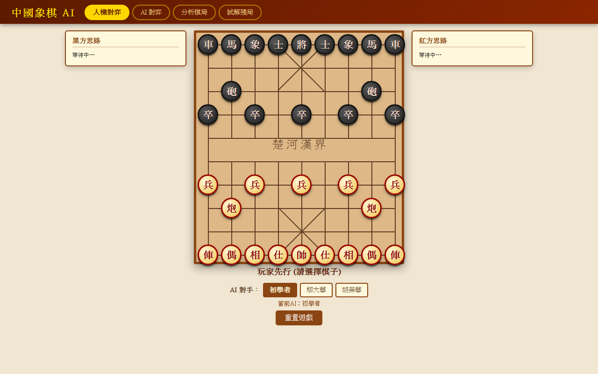 | 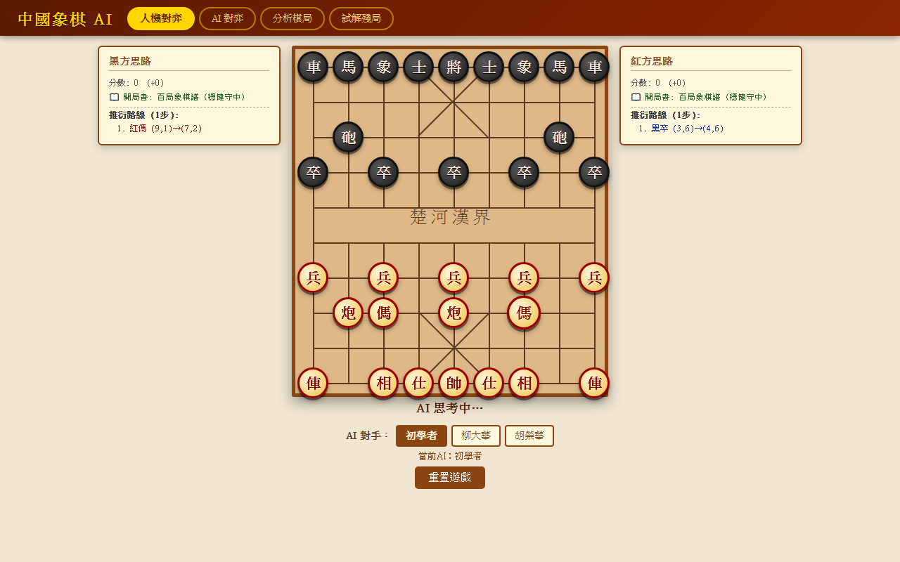 |

#### Mobile View (iPhone 12 — 390px)

| Opening Position | Mid-Game |
|---|---|
| 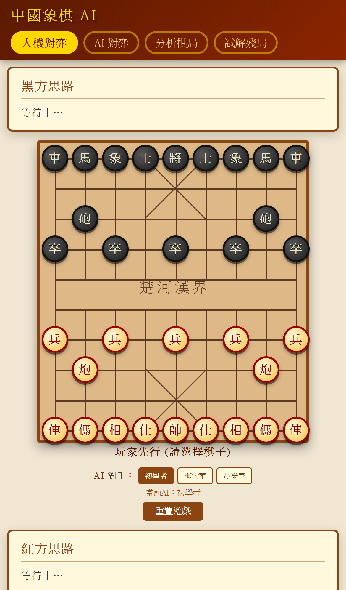 | 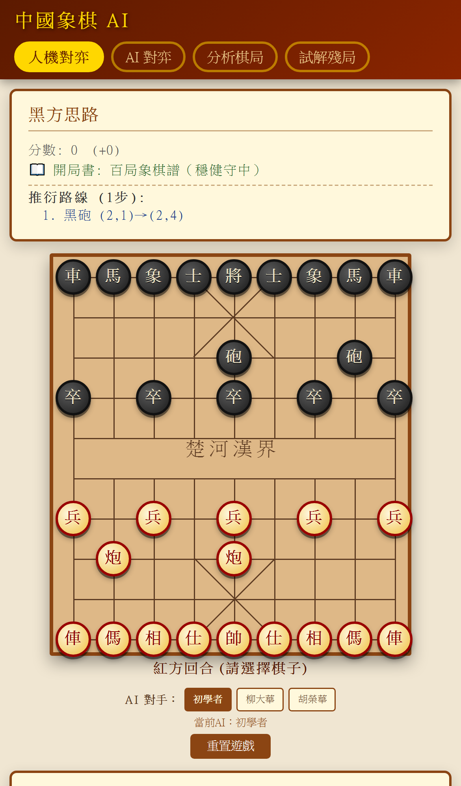 |

> Thought panel shows: **分數** · **開局書 source** · **推衍路線** (PV — colour-coded red/blue per side) · **先手 / 對方威脅**

---

### Theory in Action — Annotated Board Screenshots

#### 1. 開局定式 Opening Book

Red's cannon flies to centre (炮七平五); engine immediately plays from opening book — score=0, source=`opening_book`, name=`中炮盤頭馬`.

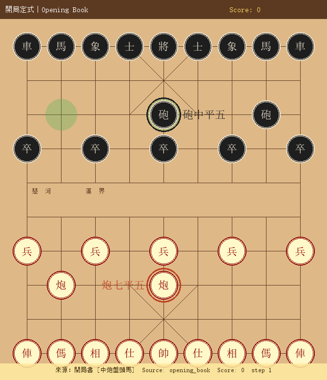

---

#### 2. 擒王分數 Catch-the-King Score

Formula proven on a real game position (Turn 51 of LiuDahua vs HuRonghua):

```
Score = MATE_SCORE − depth_to_mate = 30,000 − 1 = 29,999
```

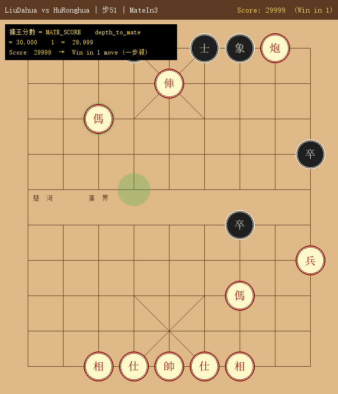

---

#### 3. 子根理論 Root Theory (SEE)

Static Exchange Evaluation classifies every capturable piece before searching:

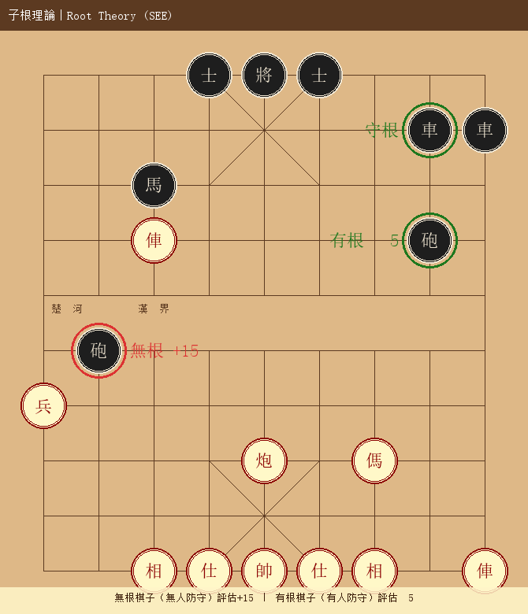

> **無根** (undefended) → eval +15 · **有根** (well-defended) → eval −5

---

#### 4. 雙方先手 Mutual Initiative

`_quick_mate_threat()` compares both sides' fastest forced-mate depth. Side with shorter path holds initiative:

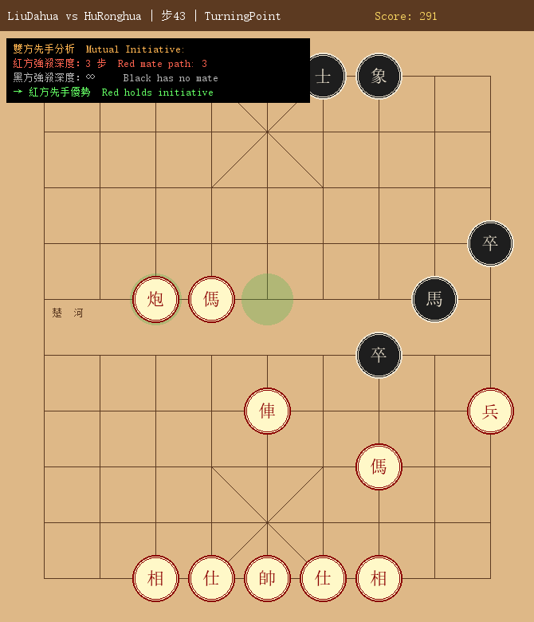

---

#### 5. 殘局絕殺 Endgame Forced Mate

Score hits 29,999 when mate-in-1 is confirmed — the final countdown of 擒王分數:

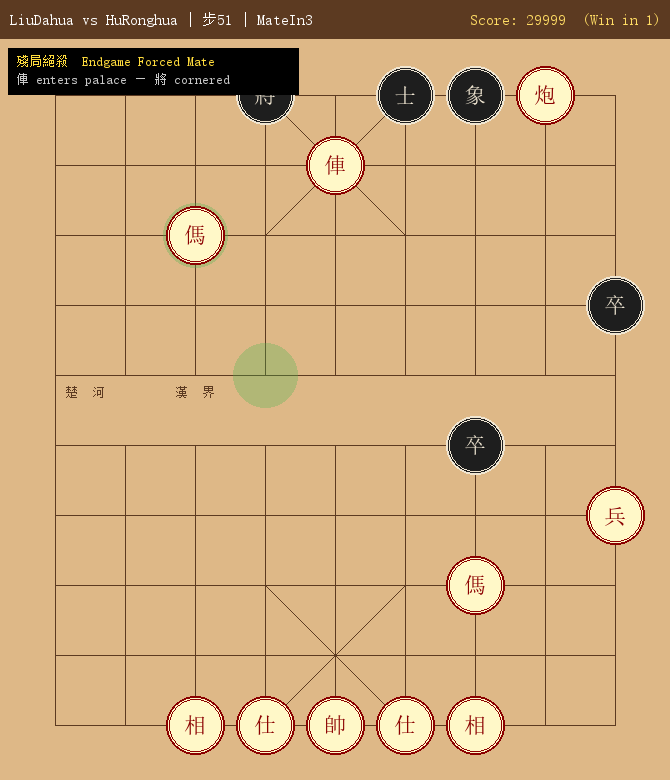

---

#### Score Progression — Full Game (51 moves)

| Turn 11 · Score 51 | Turn 35 · Score 170 | Turn 43 · Score 291 | Turn 51 · Score 29999 |
|---|---|---|---|
| 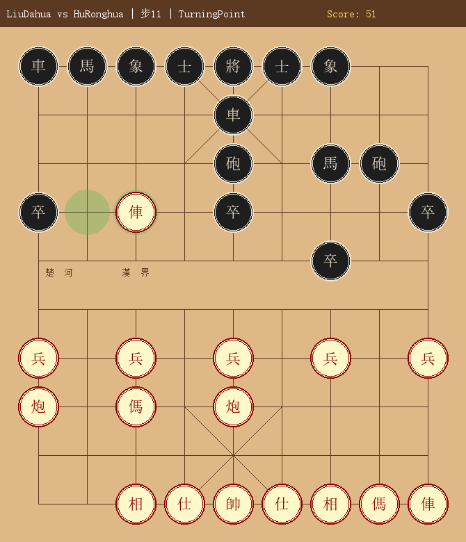 | 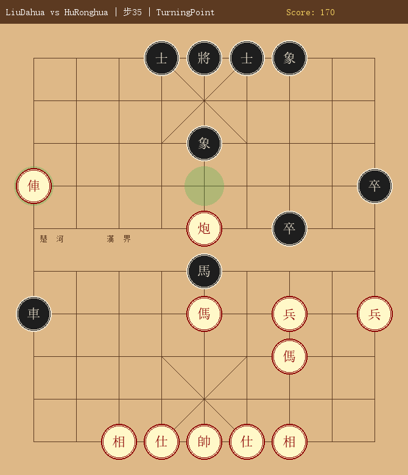 | 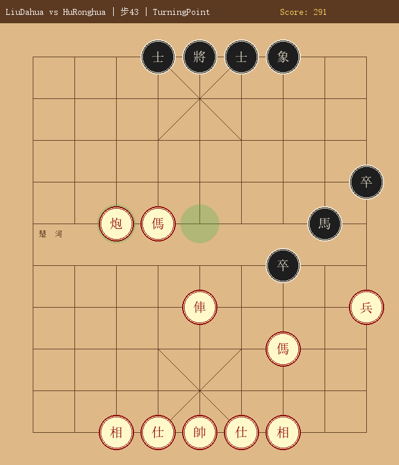 | 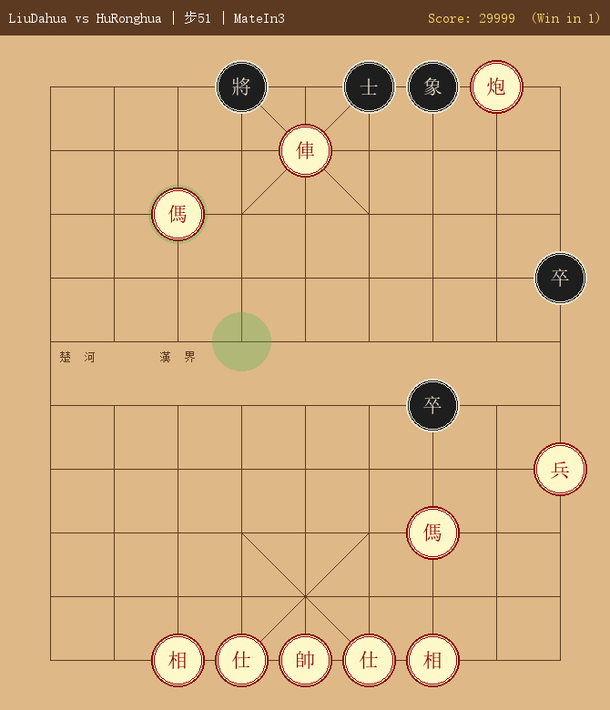 |
| First capture | Clear advantage | Dominant | Forced mate (擒王!) |

---

### Features

#### Engine (`engine.py`)
- Complete rule set: all 7 piece types, flying general, hobbled horse, cannon screen, palace restrictions
- Alpha-beta search + quiescence + iterative deepening
- Transposition table (150K entries), killer moves (2/depth), mate-in-1 shortcut
- Endgame mode: `is_endgame()` — heavy-piece devalue, king activity, deep-pawn bonus
- Opening classifier: detects 當頭炮 / 過宮炮 / 飛相局
- Mid-game mobility scoring

#### Three AI Personalities

| Name | Style | Depth | Opening Book |
|------|-------|-------|-------------|
| 初學者 Beginner | Random from top-3 | 1 | None |
| 柳大華 Liu Dahua | Tactical, quick-attack | 3 | 橘中秘 + 夾炮屏風 + 反宮馬 |
| 胡榮華 Hu Ronghua | Positional, endgame-precise | 4 | 五六炮 + 士角炮 + 龜背炮 |

#### Knowledge Base (`ai_memory.py`)
- **14 Endgame Win** patterns: 雙俥錯殺, 馬後炮, 臥槽馬, 海底撈月, 重炮殺法 …
- **10 Endgame Draw** patterns: 車炮萬年和, 馬炮對車, 士象全守和 …
- **8 Opening books** (colour-independent coordinate mirroring)
- Mid-game tactical patterns + positional tables

#### 4-Mode Web UI

| Mode | Purpose |
|------|---------|
| 人機對弈 | Human vs AI — real-time |
| AI 對弈 | 3-way round-robin tournament |
| 分析棋局 | Load saved game, step + AI analysis |
| 試解殘局 | Set up position, AI solve, save puzzles |

### Quick Start

```bash
git clone https://github.com/sipurchen/Chinese_Chess_AI.git
cd Chinese_Chess_AI
pip install flask pillow
python app.py
```
Open **http://localhost:5000**

### Generate Self-Play Records

```bash
python self_play.py
```
Produces game records + board screenshots in `AI_Games/<personality>/`.

### Project Structure

```
chinese_chess_ai/
├── engine.py              # Core engine: rules, alpha-beta, TT, killers
├── ai_memory.py           # Knowledge: endgames, openings, tactics
├── ai_tournament.py       # 3-way round-robin tournament system
├── ai_endgame.py          # Endgame puzzle library + AI solver
├── app.py                 # Flask server (4-mode REST API)
├── self_play.py           # AI vs AI sim + board renderer
├── docs/                  # Bilingual documentation
│   ├── PRODUCT_OVERVIEW.md / PRODUCT_OVERVIEW_ZH.md
│   ├── IMPLEMENTATION_PLAN.md / IMPLEMENTATION_PLAN_ZH.md
│   └── USER_MANUAL.md / USER_MANUAL_ZH.md
├── AI_Games/              # Generated game records
├── ai_wiki/               # Personality style references
├── static/                # CSS + JS
└── templates/index.html   # Single-page app
```

### Documentation

| Document | English | 中文 |
|----------|---------|------|
| Product Overview | [PRODUCT_OVERVIEW.md](docs/PRODUCT_OVERVIEW.md) | [PRODUCT_OVERVIEW_ZH.md](docs/PRODUCT_OVERVIEW_ZH.md) |
| Implementation Plan | [IMPLEMENTATION_PLAN.md](docs/IMPLEMENTATION_PLAN.md) | [IMPLEMENTATION_PLAN_ZH.md](docs/IMPLEMENTATION_PLAN_ZH.md) |
| User Manual | [USER_MANUAL.md](docs/USER_MANUAL.md) | [USER_MANUAL_ZH.md](docs/USER_MANUAL_ZH.md) |

### Branch Strategy

| Branch | Purpose |
|--------|---------|
| `Caught_the_king_master` | Stable releases (default) |
| `Caught_the_king_dev` | 擒王理論 engine R&D |
| `Web_UI_App` | Wuxia-themed WebUI App |

### License

MIT — see [LICENSE](LICENSE)

---

<a id="-中文"></a>

## 🇹🇼 中文

以有依有據的象棋理論為核心建立的 Web 中國象棋 AI 平台。每項評估皆可追溯至具名理論框架，絕非黑盒。

### 核心理論

#### 擒王分數
中國象棋唯一目的就是擒獲對方將/帥。所有評估最終回答：**「幾步後能擒王？」**
```
分數 = MATE_SCORE − 擒王所需步數
```
更快的殺局必然排名更高；對方最佳應對已透過 Alpha-Beta 完整納入計算。

#### 子根理論
靜態交換評估（SEE）對每個可被吃的棋子進行分類：

| 分類 | 條件 | 評估調整 |
|------|------|---------|
| **無根** | 無防守，吃子獲利 | +15 |
| **虛根** | 看似有防守，但反吃仍虧子 | +5 |
| **有根** | 防守完善，吃子吃虧 | −5 |

### Web UI 真實截圖

#### PC 版（1280 × 800）

| 開局初始 | 中局對弈（含 AI 思路面板） |
|---|---|
|  |  |

#### 手機版（iPhone 12 — 390px）

| 開局初始 | 中局對弈 |
|---|---|
|  |  |

> 思路面板顯示：**分數** · **開局書來源** · **推衍路線**（PV — 紅藍配色區分雙方）· **先手 / 對方威脅**

---

### 理論實戰截圖

#### 1. 開局定式

紅方炮七平五，引擎直接從開局書走棋 — 分數=0，來源=`opening_book`，局型=`中炮盤頭馬`。


---

#### 2. 擒王分數

公式以真實對局（柳大華 vs 胡榮華 第51步）驗證：

```
分數 = MATE_SCORE − 擒王所需步數 = 30,000 − 1 = 29,999
```


---

#### 3. 子根理論（SEE 靜態交換評估）

在搜索前對每枚可被吃的棋子進行分類：


> **無根**（無人防守）→ 評估+15 · **有根**（有人防守）→ 評估−5

---

#### 4. 雙方先手

`_quick_mate_threat()` 比較雙方最快強殺深度。殺路更短的一方取得先手：


---

#### 5. 殘局絕殺

一步殺確認時分數達 29,999 — 擒王分數的最終倒數：


---

#### 分數演變 — 完整對局（51步）

| 第11步 · 51分 | 第35步 · 170分 | 第43步 · 291分 | 第51步 · 29999分 |
|---|---|---|---|
|  |  |  |  |
| 首次吃子 | 明顯優勢 | 全面壓制 | 一步強殺（擒王！） |

---

### 功能特色

#### 引擎（engine.py）
- 完整規則：7 種棋子全部規則、白臉將、蹩腿馬、炮架子、九宮限制
- Alpha-Beta 搜索 + 靜止搜索 + 迭代加深
- 置換表（15 萬條目）、殺手著法（每層 2 個）、一步殺捷徑
- 殘局模式：`is_endgame()` — 重子貶值、將帥活躍度、深入兵加分
- 開局辨識：偵測當頭炮 / 過宮炮 / 飛相局
- 中局機動性評分

#### 三名 AI 棋手個性

| 棋手 | 風格 | 搜索深度 | 開局書 |
|------|------|---------|--------|
| 初學者 | 前三名隨機選 | 1 | 無 |
| 柳大華 | 戰術型，快攻 | 3 | 橘中秘 + 夾炮屏風 + 反宮馬 |
| 胡榮華 | 陣地型，殘局精確 | 4 | 五六炮 + 士角炮 + 龜背炮 |

#### 知識庫（ai_memory.py）
- **14 種殘局勝法**：雙俥錯殺、馬後炮、臥槽馬、海底撈月、重炮殺法…
- **10 種殘局和法**：車炮萬年和、馬炮對車、士象全守和…
- **8 套開局書**（顏色無關，黑方自動鏡像）
- 中局戰術手段 + 棋子位置評分表

#### 四模式 Web UI

| 模式 | 用途 |
|------|------|
| 人機對弈 | 與 AI 即時對局 |
| AI 對弈 | 觀看三方循環賽 |
| 分析棋局 | 載入棋譜逐步回放 + AI 分析 |
| 試解殘局 | 自由擺棋 + AI 求解 + 儲存 |

### 快速啟動

```bash
git clone https://github.com/sipurchen/Chinese_Chess_AI.git
cd Chinese_Chess_AI
pip install flask pillow
python app.py
```
在瀏覽器開啟 **http://localhost:5000**

### 產生自對弈記錄

```bash
python self_play.py
```
棋局記錄與截圖儲存至 `AI_Games/<棋手>/`。

### 專案結構

```
chinese_chess_ai/
├── engine.py              # 核心引擎：規則、Alpha-Beta、置換表、殺手著法
├── ai_memory.py           # 知識庫：殘局、開局、戰術
├── ai_tournament.py       # 三方循環賽系統
├── ai_endgame.py          # 殘局題庫 + AI 求解
├── app.py                 # Flask 伺服器（四模式 REST API）
├── self_play.py           # AI vs AI 自對弈 + 棋盤渲染
├── docs/                  # 雙語文件
│   ├── PRODUCT_OVERVIEW.md / PRODUCT_OVERVIEW_ZH.md
│   ├── IMPLEMENTATION_PLAN.md / IMPLEMENTATION_PLAN_ZH.md
│   └── USER_MANUAL.md / USER_MANUAL_ZH.md
├── AI_Games/              # 生成的棋局記錄
├── ai_wiki/               # 棋手風格參考資料
├── static/                # CSS + JS
└── templates/index.html   # 單頁應用模板
```

### 文件導覽

| 文件 | English | 中文 |
|------|---------|------|
| 產品概述 | [PRODUCT_OVERVIEW.md](docs/PRODUCT_OVERVIEW.md) | [PRODUCT_OVERVIEW_ZH.md](docs/PRODUCT_OVERVIEW_ZH.md) |
| 實作計劃 | [IMPLEMENTATION_PLAN.md](docs/IMPLEMENTATION_PLAN.md) | [IMPLEMENTATION_PLAN_ZH.md](docs/IMPLEMENTATION_PLAN_ZH.md) |
| 操作手冊 | [USER_MANUAL.md](docs/USER_MANUAL.md) | [USER_MANUAL_ZH.md](docs/USER_MANUAL_ZH.md) |

### 分支策略

| 分支 | 角色 |
|------|------|
| `Caught_the_king_master` | 穩定版（預設分支） |
| `Caught_the_king_dev` | 擒王理論 R&D 主分支 |
| `Web_UI_App` | 武俠仙人對弈 WebUI App |

### 授權

MIT — 詳見 [LICENSE](LICENSE)

---

<div align="center">
<sub>Built with Claude (Anthropic) × Gemini (Google) × ChatGPT (OpenAI)</sub><br>
<sub>GitHub: <a href="https://github.com/sipurchen/Chinese_Chess_AI">sipurchen/Chinese_Chess_AI</a></sub>
</div>
